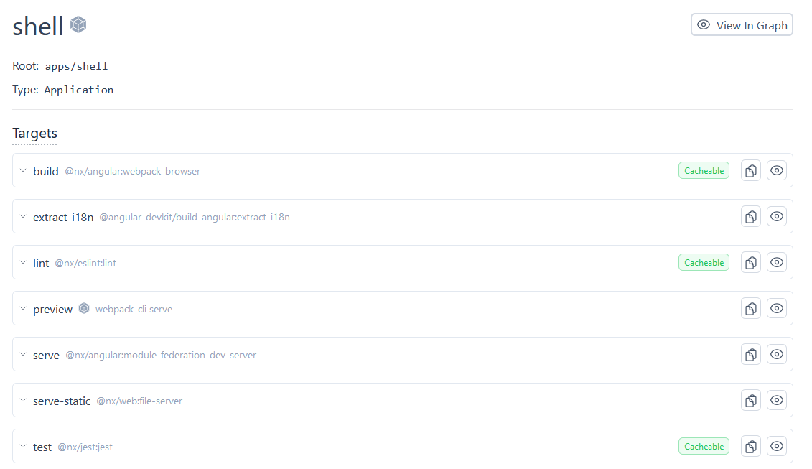
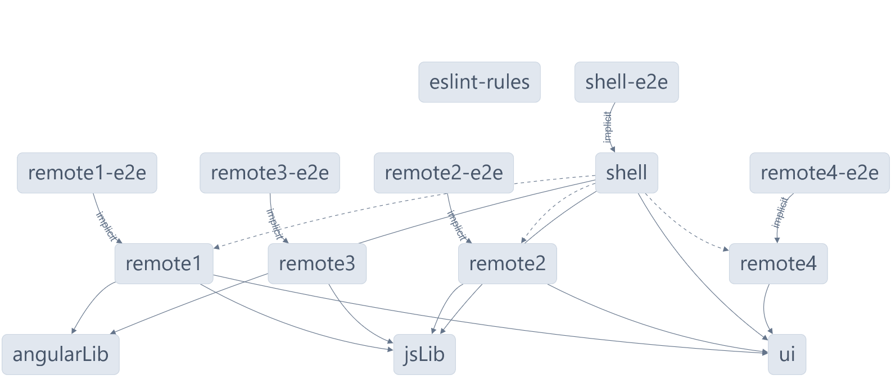

# PocAokPortalrahmen Todos

## What's part of the POC?
- multiple apps co-existing (Angular & React)
- shared ESLint rules
- shared global styles
- module federation with multiple oulets
- individual routing inside each remote (max. flexibility in stacking together fachanwendungen)
- shared libs (Angular specigic & JS-global)
- simple way of communication between microfrontends (singleton service)
- e2e-projects already set up for playwright (can be decided for each app/lib individually => cypress etc.)
- jest configured and unit tests ready to run
- check out nx graph and nx show (find below)

## What else can be done easily?
- one-command setup of storybook

## Not done a POC yet for:
- Microfrontend mechanisms framework-agnostic with Single-SPA
- import of global style-tokens
- including PHP-App in workspace
- more ways of communication between MFEs (shared state, event bus)
- provide libs in various versions for apps as npm-package

## More on CI setup
CI can easyly be set up for all apps.
[Click here to finish setting up your workspace!](https://cloud.nx.app/connect/v5Hi7HWYpU)

## Needs to be added in POC
- Single-SPA
- Orchestratation at runtime (load config from CMS)
- embedd Design Tokens
- refactor existing structure partly in new Nx workspace
- several ways of communication (event bus, shared services, window events, broadcast channels etc.)
- Individual navigation
- configuration of text for several tenants

## Run tasks
You can start each app individually or the shell that contains remote1 and remote2 as micro-frontends. Please choose new ports if you run them all at the same time: e.g. --port=4200
Now using Native Federation! You have to have all apps 
To run the dev server for your apps:

Angular-apps:
```sh
npx nx serve shell
```
```sh
npx nx serve remote1
```

```sh
npx nx serve remote2
```

React-app:
```sh
npx nx serve remote3
```


Following commands go for each app and lib.
To create a production bundle:
```sh
npx nx build shell
```

All infos on certain apps or libs:

```sh
npx nx show project shell
```
Example



See the project graph:
```sh
npx nx graph
```
Currently:



## Add new projects

While you could add new projects to your workspace manually, you might want to leverage [Nx plugins](https://nx.dev/concepts/nx-plugins?utm_source=nx_project&utm_medium=readme&utm_campaign=nx_projects) and their [code generation](https://nx.dev/features/generate-code?utm_source=nx_project&utm_medium=readme&utm_campaign=nx_projects) feature. 
Use the plugin's generator to create new projects. To generate a new application, use:


For Angular:
```sh
npx nx g @nx/angular:app app-name
```

For React:
```sh
npx nx g @nx/react:app app-name
```

For Vue:
```sh
npx nx g @nx/vue:app app-name
```

For Web Components:
```sh
npx nx g @nx/web:app app-name
```

For JS:
```sh
npx nx g @nx/js:app app-name
```

To generate a new library, use:

For Angular:
```sh
npx nx g @nx/angular:lib lib-name
```

For React:
```sh
npx nx g @nx/react:lib lib-name
```

For Vue:
```sh
npx nx g @nx/vue:lib lib-name
```

For Web Components and JS:
```sh
npx nx g @nx/js:lib lib-name
```
Other interesting options:
- EXPO: an open-source platform for making universal native apps for Android, iOS, and the web with JavaScript and React.
- React Native: open-source UI software framework used to develop applications for Android, Android TV, iOS, macOS, tvOS, Web, Windows and UWP by enabling developers to use the React framework along with native platform capabilities.
- Remix React Framework: Remix is an open source full stack web framework. The software is designed for web applications built with front-end JavaScript frameworks like React and Vue.js. Remix supports server-side rendering and client-side routing.
  You can use `npx nx list` to get a list of installed plugins. Then, run `npx nx list <plugin-name>` to learn about more specific capabilities of a particular plugin. Alternatively, [install Nx Console](https://nx.dev/getting-started/editor-setup?utm_source=nx_project&utm_medium=readme&utm_campaign=nx_projects) to browse plugins and generators in your IDE.

## Add new EsLint-Rules
New ESLint-rules can be created with one command:
```sh
npx nx g @nx/eslint:workspace-rule my-custom-rule
```
There is one rule that currently is set to global error for all libs Angular and React apps.

# Accessibility
- https://www.openable.it/en/legal-requirements/%F0%9F%87%A9%F0%9F%87%AA-bitv/

# Storybook

## Useful links
Learn more:

- [Learn more about this workspace setup](https://nx.dev/getting-started/tutorials/angular-monorepo-tutorial?utm_source=nx_project&amp;utm_medium=readme&amp;utm_campaign=nx_projects)
- [Learn about Nx on CI](https://nx.dev/ci/intro/ci-with-nx?utm_source=nx_project&utm_medium=readme&utm_campaign=nx_projects)
- [Releasing Packages with Nx release](https://nx.dev/features/manage-releases?utm_source=nx_project&utm_medium=readme&utm_campaign=nx_projects)
- [What are Nx plugins?](https://nx.dev/concepts/nx-plugins?utm_source=nx_project&utm_medium=readme&utm_campaign=nx_projects)
- https://roshancloudarchitect.me/building-angular-and-react-microfrontends-with-single-spa-and-webpack-module-federation-a-9f65fb6e179b
